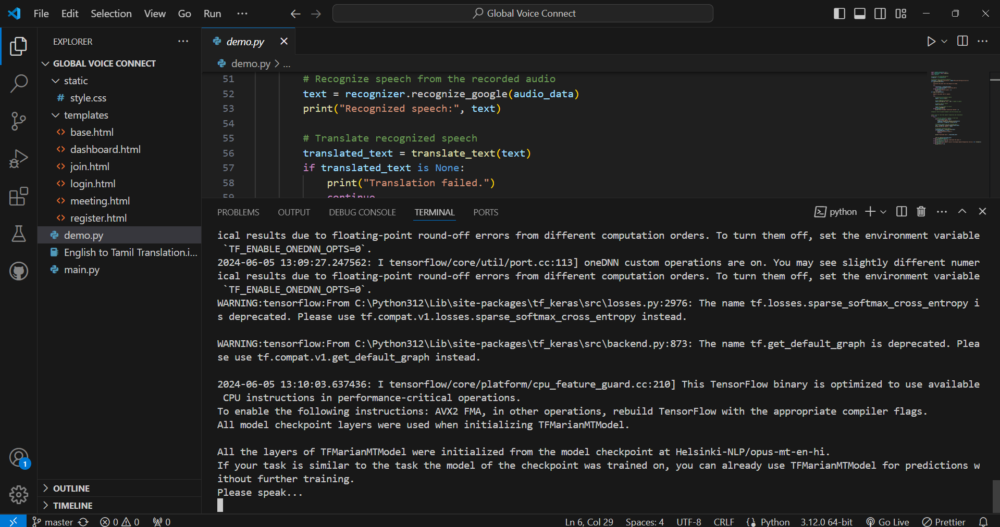
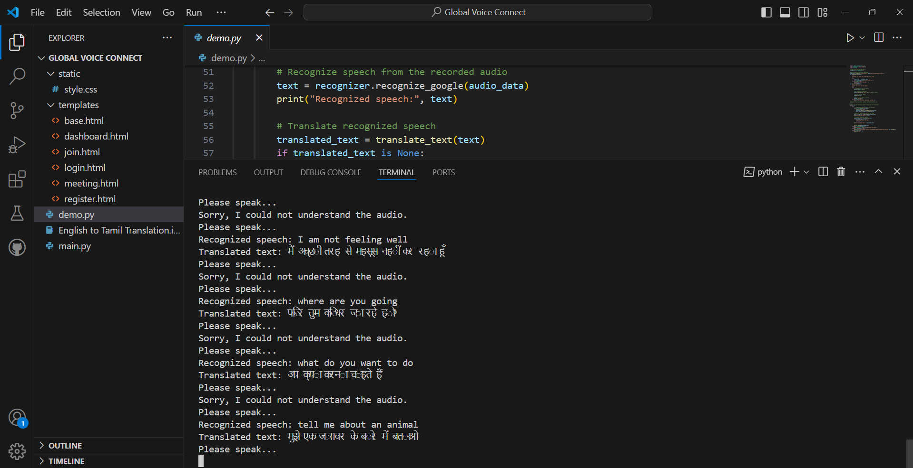
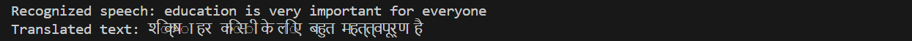
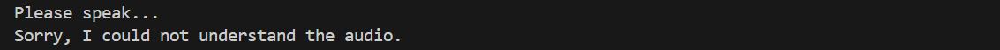

<div id="top"></div>

# Global Voice Connect Using Deep Learning

<details>
<summary>Table of contents</summary>

-   [Overview](#overview)
-   [Technology Stack](#technology-stack)
-   [Getting Started](#getting-started)
-   [Features](#features)
-   [Screenshots](#screenshots)
-   [Link](#link)

</details>

## Overview

This project aims to develop a real-time language translator for voice calls, enhancing cross-lingual communication. Utilizing Automatic Speech Recognition (ASR) and Text-to-Speech (TTS) technologies, the system converts spoken language to text and back to speech, ensuring a seamless user experience. Advanced deep learning models, particularly transformer architectures, are employed to achieve high accuracy and efficiency in live translation. By focusing on improving translation quality, the project seeks to revolutionize global communication, fostering better understanding and collaboration across diverse linguistic backgrounds.
## Technology Stack

- Speech_recognition
- pyttsx3
- Transformers
- Callsintegration
- Bert
- Seq2Seq
- Natural Language Processing
- DecoderEncoder
- Tokenization

## Getting Started

1. Clone the repository:

   ```bash
   https://github.com/AfzalAnsariMd/Global-Voice-Connect-using-deep-learning.git
   cd Global-Voice-Connect-using-deep-learning

   ```

2. To run the project:

   ```bash
   python demo.py
   ```


## Features

- **Automatic Speech Recognition (ASR):** Utilizes advanced ASR technology to accurately convert spoken language into text in real-time.
- **Text-to-Speech (TTS):** Converts translated text back into speech, offering a natural and interactive communication experience.
- **Advanced Deep Learning Models:** Employs state-of-the-art transformer architectures to ensure high accuracy and efficiency in translation.

## Screenshots

<table>
    <tr>
        <th>Desktop View</th>
    </tr>
    <tr>
      <td colspan="3" style="text-align: left; font-weight: bold;">Home</td>
    </tr>
    <tr>
        <td>
            
        </td>
    </tr>
    <tr>
      <td colspan="3" style="text-align: left; font-weight: bold;">Project Output</td>
    </tr>
    <tr>
        <td>
            
        </td>
    </tr>
    <tr>
      <td colspan="3" style="text-align: left; font-weight: bold;">Translated Text</td>
    </tr>
    <tr>
        <td>
            
        </td>
    </tr>
    <tr>
      <td colspan="3" style="text-align: left; font-weight: bold;"></td>
    </tr>
    <tr>
      <td colspan="3" style="text-align: left; font-weight: bold;">Speak Properly</td>
    </tr>
  <tr>
        <td>
            
        </td>
    </tr>
</table>
## Link
[🚀 Live Page](#)

<p align="right"><a href="#top">⬆️ Back to Top</a></p>
